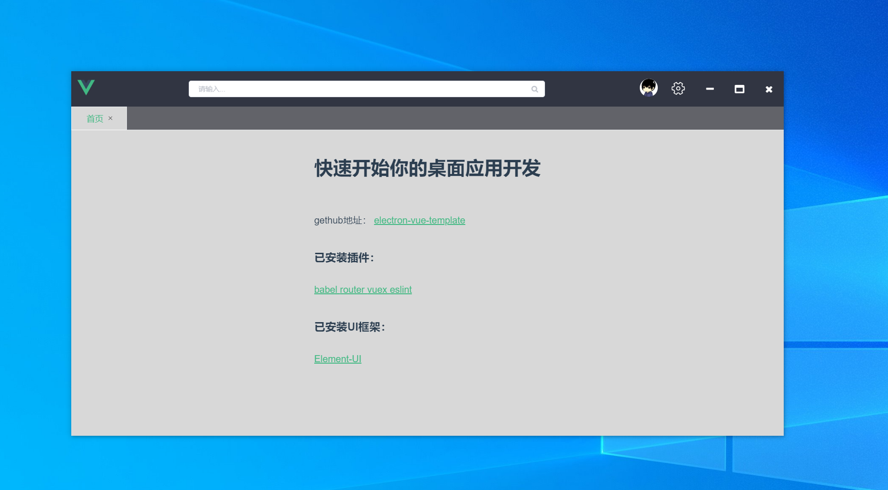
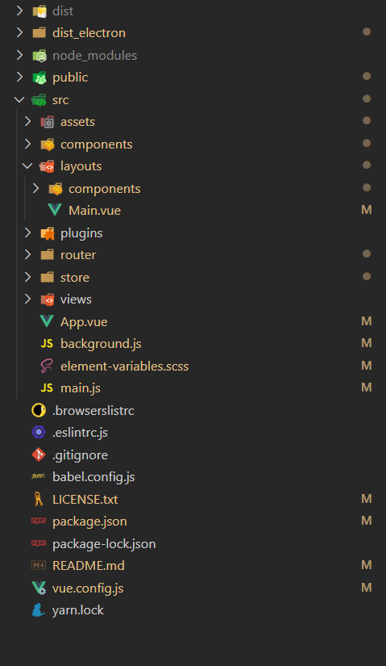

# [electron](https://www.electronjs.org/)+[vue](https://cn.vuejs.org/)快速开始模板

### &nbsp;此模板是用 [vue-cli3](https://cli.vuejs.org/) + [vue-cli-plugin-electron-builder](https://nklayman.github.io/vue-cli-plugin-electron-builder/)构建的.

### 搭建环境：
- nodejs v12.14.1
- electron 9.0.0
- vue 2.6.11

#### 截图




#### &nbsp;已安装的插件：
+ [babel](https://github.com/vuejs/vue-cli/tree/dev/packages/%40vue/cli-plugin-babel)
+ [router](https://github.com/vuejs/vue-cli/tree/dev/packages/%40vue/cli-plugin-router)
+ [vuex](https://github.com/vuejs/vue-cli/tree/dev/packages/%40vue/cli-plugin-vuex)
+ [eslint](https://github.com/vuejs/vue-cli/tree/dev/packages/%40vue/cli-plugin-eslint/)
+ [sass](https://sass-lang.com/dart-sass)
+ [svg-sprite-loader](https://www.npmjs.com/package/svg-sprite-loader)
+ [terser-webpack-plugin 代码压缩](https://www.npmjs.com/package/terser-webpack-plugin)
#### &nbsp;已安装的UI库：
+ [Element-UI](https://element.eleme.cn/#/zh-CN/component/installation)

#### &nbsp;已安装的其他库：
+ [vue-router-tab](https://bhuh12.github.io/vue-router-tab/zh/guide/)
+ [is-url](https://www.npmjs.com/package/is-url)

#### SVG精灵图标：
"src\assets\svg-icons\UI-icons\svg"文件夹下的svg文件如：“vue.svg”可以调用svgIcon组件使用：
```
<svg-icon file-name="vue" size="20px" />
```
#### 包含了 [font-awesome 4.7](http://www.fontawesome.com.cn/) 图标
```
<i class="fa fa-times"></i>
```

## nsis基本打包配置：
```
nsis: {
    "oneClick": false, // 是否一键安装
    "allowElevation": true, // 允许请求提升。 如果为false，则用户必须使用提升的权限重新启动安装程序。
    "allowToChangeInstallationDirectory": true, // 允许修改安装目录
    "installerIcon": "public/favicon.ico",// 安装图标
    "uninstallerIcon": "public/favicon.ico",//卸载图标
    "installerHeaderIcon": "public/favicon.ico", // 安装时头部图标
    "createDesktopShortcut": true, // 创建桌面图标
    "createStartMenuShortcut": true,// 创建开始菜单图标
    "shortcutName": "myapp", // 图标名称
    'license': 'LICENSE.txt'
},
```

##### 可在“vue.config.js”里自行修改配置

## 如何使用：
### -1.前提：
+ 全局安装[nodejs v12.x](https://nodejs.org/en/)

+ 安装yarn
  + ``` npm install -g yarn ```
+ 安装cnpm代替npm并给npm和yarn配置淘宝镜像源：
  + npm: <br/>
  ``` npm install -g cnpm --registry=https://registry.npm.taobao.org ```
  + yarn:<br/>
   ``` yarn config set registry https://registry.npm.taobao.org/ ```
+ 全局安装[vue-cli3或4](https://cli.vuejs.org/)
  + &nbsp; ``` npm install -g @vue/cli 或者 yarn global add @vue/cli  ```
### 0.克隆
```
git clone https://github.com/mark134340/electron-vue-template.git
```

### 1.安装依赖
```
npm install 推荐 yarn install
```

### 2.启动 开发模式
```
npm run electron:serve 推荐 yarn electron:serve
```

### 3.打包
```
npm run electron:build 推荐 yarn electron:build
```
## 注意：
#### favicon.ico图标大小为256*256,可以用[IcoFX 3](https://www.updatestar.com/directdownload/icofx/2397493)工具制作.
#### LICENSE.txt文件需要另存为ANSI格式，否则会出现乱码.

### 关于vue-cli-plugin-electron-builder插件的详细使用文档：
请阅读 [配置文档](https://nklayman.github.io/vue-cli-plugin-electron-builder/).
